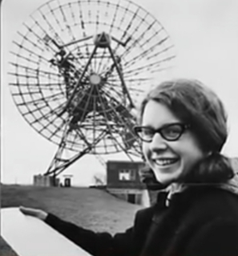
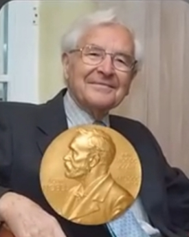
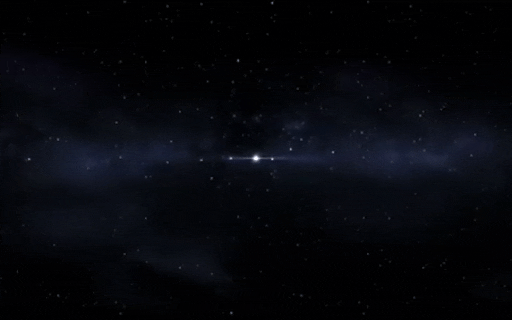
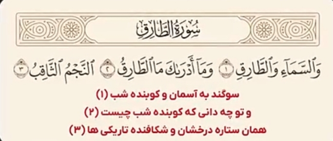
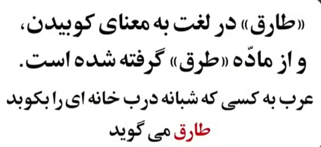
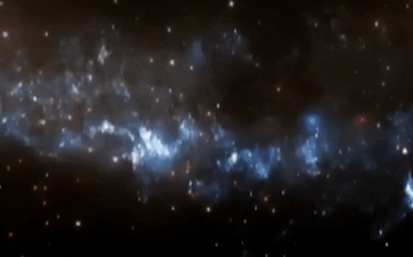

# ادعا

<video src="./claim.mp4" controls>

# جواب

در سال 1967 جاسلین بل برنل دانشمند و اخترفیزیکدان بریتانیایی 

    

هنگام استفاده از یک رادیو تلسکوپ بزرگ متوجه سیگنال عجیب و منظم شد که به طور مکرر در فواصل زمانی دقیق دریافت شد

    

سیگنال دریافتی از این رادیو تلسکوپ شبیه به صدای کوبیدن در به نظر می رسید
تا اون زمان هیچ جرم طبیعی شناخته شده ای در فضا وجود نداشت که چنین الگویی از امواج رادیویی منتشر کنه 

و در سال 1974 آنتونی هویش اخترفیزیکدان انگلیسی 

    

 
کشف میکنه که این سیگنال ها از یک ستاره نوترونی سرچشمه میگیره که با سرعت بسیار بالایی می چرخه

    

این ستاره شبیه به یک فانوس چشمک زن عمل میکنه و پرتوهایی از انرژی رادیویی به صورت منظم در فضا پخش میکنه
به دلیل این کشف او موفق به دریافت جایزه نوبل شد

این نوع ستاره ها پولسار نام گرفتند که به معنای ستاره تپنده است.
شگفت انگیز تر اینکه خداوند 1400 سال قبل در قرآن از ستاره ای به نام طارق سخن میگه

    

خداوند این ستاره رو طارق نامیده و اون رو نوری شکافنده توصیه کرده طارق در زبان عربی به معنای 

    
    

کوبنده یا کسی که در هنگام شب در میکوبه و این صدای ظبط شده ستاره پولساره که دانشمندان در قرن 21 با فناوری های پیشرفته موفق به ظبط اون شدن

    

به وضوح مشخصه که این صدا شبیه به صدای ضربه زدن یا کوبیدن مداومه انگار کسی به در میکوبه سوال اینجاست که
چطور ممکنه قرآنی که 14 قرن پیش نازل شده چنین توصیف دقیقی از پدیده ای داشته باشه که تنها با ابزار های علمی پیشرفته امروزی قابل شناسائیه ؟
آیا این موضوع انسان رو به تامل وانمیداره ؟