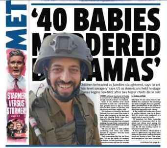

# ادعا 1

<video src="./claim-part1.mp4" controls>

# جواب  1

استدلال این ملحد درمورد قرآن رو به همدیگه شنیدیم
که قرآن برای فردی که اخلاق مدار هستش نفرت انگیزه
اما نظر ایشون درمورد ارتش اسرائـیل چیه ؟

# ادعا 2

<video src="./claim-part2.mp4" controls>

# جواب  2

ایشون میگه ارتش اسرائـیل با اخلاق ترین ارتش جهانه ، چرا ؟
چون باعث قـتل و کشـتار بیش از چهل هزار انسان بی گناه شد

قرآن نفرت انگیزه چرا ؟ چون قرآن میگه :
هر کسی جان یک انسان رو نجات بده انگار جان همه انسان هارا نجات داده

ارتش اسرائـیل بهترین ارتش جهانه چرا ؟ 
چون باعث شده هیچ بیمارستانی در غزه نباشه و همه رو بمب باران کرده

اما ارتش اسرائـیل بهترین ارتش جهانه چرا ؟ 
چون باعث شده 20 هزار کودک به قتل برسند

اما قرآن نفرت انگیزه چرا ؟ چون میگه :
احترام پدر و مادراتونو نگه داشته باشید

ارتش اسرائـیل بهترین ارتش جهانه چرا ؟ 
چون باعث شده 15 هزار زن کشـته بشن

اسلام نفرت انگیزه چرا چون پیامبر اسلام میفرماید :
بهترین شما کسی است که بهترین رفتار رو داخل خونه به همسرش داشته باشه

ارتش اسرائـیل بهترین ارتش جهانه چرا ؟ 
چون باعث شد 2 میلیون انسان تو غزه خونه هاشونو از دست بدن

قضاوت با شما و استدلال و منطق یک ملحد اینه حالا این آدما چجوری میخان بهتون راه و روش درست زندگی کردن رو یاد بدن ؟
راه و روشه درست زندگی کردن اینا دقیقا مثل ارتش اسرائـیله، قـتل و غـارت

#### ادعا و جواب 3 مرتبط به زمان ریاست جمهوری جو بایدن هست یعنی 2023
# ادعا 3

<video src="./claim-part3.mp4" controls>

# جواب  3

فلسطینی ها اومدن 40 بچه اسرائـیلی سـر بـریدن
سوال اینجاست اجساد این کودکان کجاست ؟ مشخص نیست
تصاویر این جنـایت کجاست ؟ وجود نداره
اسرائـیل حتی به متحدان خودش هم دروغ میگه
جو بایدن رئیس جمهور آمریکا گفته :
تصاویری از سر بریدن کودکان اسرائیلی توسط فلسطینی هارو دیده
washington post این درحالی است که واشنگتون پست در این مورد گفته بود نتانیاو بایدن رو فریب داده

روزنامه واشنگتون پست به نقل از کاخ سفید اعلام کردکه نه بایدن و نه هیچ مسئول دیگری چنین تصاویری ندیدن
و صحت گزارش ها درمورد سر بریدن کودکان به دست فلستیطنی ها تایید نمیکنه
سایت اسرائـیل گریتون هم گفته :

شایع سر بریدن کودکان توسط یک صهیونیسم افراطی پخش شده این سایت نام رهبر شهرک نشینان فاش کرد
که شایعه سر بریدن کودکان در شهرک کفارزه در جریان طوفان نقضا رو به راه انداخت 
اورن زیو خبرنگار اسرائیلی میگه در سفری که به کفارزه داشتیم هیچ مدارکی دال بر کشتار کودکان توسط فلسطینی ها مشاهده نکردیم

مایع *تعسف* که اسرائیل از این ادعا های نادرست برای تشدید بمب باران غزه استفاده میکنه

حالا دوست عزیزی که واسه خبر جعلی اینقدر ناراحت شدی 
آیا میدونی تو غزه بچه هاشون دارن کشته میشن ناراحت نیستی
چرا انسانیتت گل نمیکنه و بهت نمیگه هیچ فرقی بین کودک اسرائیلی و کودک فلسطینی وجود نداره

و خواهرم میدونی تو غزه چند زن و دختر توی غزه کشته شدن چرا وجدانت بیدار نمیشه 
این مقاله رو اشتراک بزار واسه افرادی که دم از انسانیت میزنن اما چشمشون روی جنایت های متجاوزین و نسل کشی فلسطینی ها بستن
و برده فکری اسرائیل و رسانه های اون شدن و هر چرندیات اونا میگن بدون هیچ فکر و تحقیقی باور میکنن 

# و ادامه

ای اهل غزه شما نماد افتخارید شما نماد شرف برای هر مسلمانید شما نماد ایستادگی برای هر انسانی هستید 
همانطوری که که خیلی ها با استقامت اهل غزه مسلمان شدند کاری اخونا ما کردن چی بود بجز اینکه خیلی ها رو هم از دین زده کردند و خیلی هارا بی دین کردند با عملکردنشون

اما اهل غزه نه با سخن بلکه با عمل خیلی هارو با اسلام زیبای محمدی آشنا کردن
اسلام یعنی چی ؟ اسلام یعنی بخشندگی اسلام یعنی مهربانی و نمونه مهربانی رو شما در برخورد با اسرای اسرائیلی دیدید

اما اسرای مسلمان با چهره های سوخته از زندان های اسرائیل میومدن بیرون
بهتون ظلم شد اما شما به اسرای اسرائیلی ظلم نکردین
چون شما شاگردان مکتب محمد رسول الله هستید

ای اهل غزه همه ما مسلمانان شاگردان دانشگاه اسلامی شما هستیم

اسـ*رائیـل
فلسـ*ـطینی
سر بریدن
ســر بـ*ریدن
غـ*زه