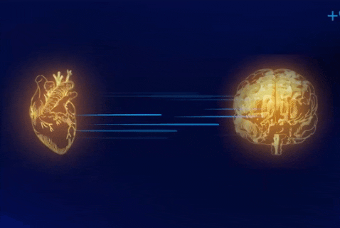
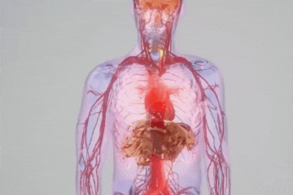
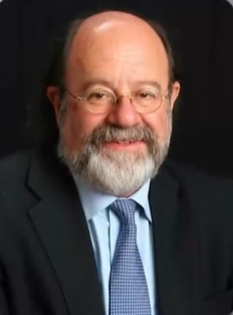

# ادعا 

<video src="./claim.mp4" controls>

# جواب 

در سال 1991 دکتر جیمز آرمور

    

یکی از نخستین دانشمندانی بود که شبکه ای از نورون های قلبی رو کشف کرد او نشان داد که قلب دارای یک سیستم عصبی مستقله و قلب فقط یک پمپ نیست بلکه یک مرکز اطلاعاتی مستقل در بدنه 

    

و در سال 1991 دکتر رولین مک کریتی از موسسه آمریکایی هارت مث
 
 

    

 
تحقیقاتی رو انجام داد که نشان داد قلب و مغز بطور مدام در حال ارسال اطلاعات به یکدیگر هستن 
نکته جالب اینجاست که قلب سیگنال های بیشتری به مغز ارسال میکند تا مغز به قلب 

    
    

این تحقیقات نشان داد که سیگنال های قلبی بر فعالیت مغز اثر میگذارد 
و حتی میتواند بر نوع تصمیم گیری انسان تاثیر داشته باشد 
 
در اوایل دهه 2000 دکتر گری شوارتز دانشمند روانشناس از داشنگاه آریزونا

    

 
بر روی بیمارانی که پیوند قلب دریافت کرده بودند مطالعاتی انجام داد 
اون متوجه شد که برخی از این بیماران بعد از دریافت قلب جدید ، خاطرات و ویژگی های شخصیتی فرد اهدا کننده را تجربه میکنن 
بعضی از بیماران غذایی را دوست داشتن که قبلا از اونها متنفر بودن یا حتی موسیقی کورد علاقه اهدا کننده رو می پسندیدن

برخی مطالعات نشون میده که قلب دارای نوعی حافظه سلولی است و اطلاعاتی رو ذخیره میکنه که حتی مغز هم نمیتونه اونهارو ذخیره کنه

در سال 2003 پژوهشگران موسسه هارت مث کشف کردن که قلب قوی ترین میدان مغناطیسی بدن رو تولید میکنه که حتی از مغز هم قوی تره
میدان مغناطیسی قلب 5 هزار بار قوی تر از مغزه این میدان میتونه بر بدن خود فرد و حتی اطرافیانش تاثیر بذاره 

این تحقیقات علمی نشون میده که قلب یک مرکز اطلاعاتی هوشمنده که میتونه بر مغز تاثیر بگذاره

و تصمیمات ما رو تغییر بده 
احساسات ، حافظه و حتی سلامتی مغز همگی تحت تاثیر فعالیت قلب هستن 

پس این جمله معروف که میگه
#### با قلبت تصمیم بگیر
فقط یک استعاره نیستش بلکه یک حقیقت علمیه 
و قرآن از قلب بعنوان مرکز اگاهی و احساسات یاد کرده که امروزه با تحقیقات علمی ثابت شده .

پس نه تنها قرآن اشتباه نکرده بلکه یافته های علمی جدید نشون میده که قرآن 1400 سال پیش به حقیقتی اشاره کرده که دانشمندان تازه به بخشی از آن پی بردن 
این نشان دهنده اینه که قرآن حاوی حقایقی فراتر از دانش زمان نزول خودشه 

این یکی از نشانه های اعجاز علمی قرآن محسوب میشه