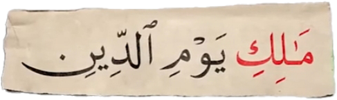
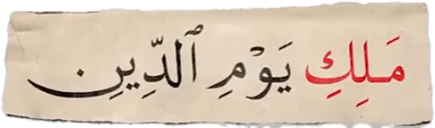

# ادعا

<!-- <video src="./claim.mp4" controls> -->

# جواب 

اولا حضرت محمد نویسنده قرآن نیست ، قرآن از طرف خداوند بر پیامبر نازل شده
دوما روایت **حفض** از عاصم که در آخر قرآن نوشته شدهیک نوع روایت از قرائت قرآنه
و در زبان عربی **قرائت** به تحت اللفظلی یعنی **خواندن** و از نظر واژه شناسی یعنی **شیوه خوانش**
این قرائت ها بخاطر وجود لهجه ها و گویش های مختلف عربی به وجود اومده
و در زمان نزول قرآن قبایل مختلف عرب لهجه های متفاوتی داشتن 
و قرآن به گونه ای نازل شد که همه قبایل بتوانند آن را بفهمند
حضرت محمد در صحیح بخاری میفرماید :
#### قران بر 7 قرائت نازل شده ، پس هر کدام برای شما آسان تر است بخوانید

همون طوری که در زبان فارسی خودمون لهجه های متفاوتی داره 
مثل مشهدی ، اصفهانی ، تهرانی و یزدی  که یک جمله یکسان با لهجه های مختلف گفته میشه اما با همون کلمات و همون معنی 

اما تفاوت قرائت های مختلف به عنوان مثال
در روایت حفص از عاصم آیه 4 سوره فاتحه

    

### مالِکِ یَوم الَّدین
اما در روایت ورش از نافع

    

### مَلِکِ یَومِ الدِین
خونده میشه که هر دو به یک معنی هستن فقط شیوه خوانش در روایت ها متفاوته
این یعنی اینکه فقط با اون لحجه ای که داشتند می خونن نه اینکه قرآن های ما با همدیگه اختلاف داره
یا ما چندین قرآن داریم 
در کل کره زمین ما فقط یک قرآن داریم قرآنی که فقط 114 سوره داره 
وقدیمی ترین قرآن که در موزه ها نگهداری میشه و مربوط به زمان خلافت عثمان میشه همین قرآنه با همین کلمات و با همین آیات
 
#### و دوست عزیزی که شما داری این مقاله رو میخونی با یک سرچ ساده خیلی راحت به حقیقت میتونی برسی ما در عصر تکنولوژی هستیم نزارید سرتون کلاه بزارن