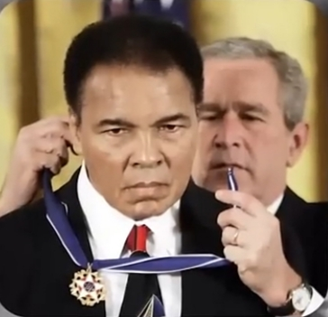
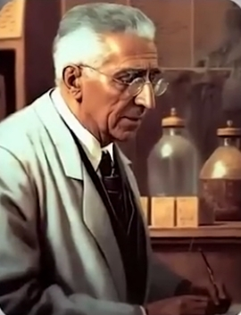
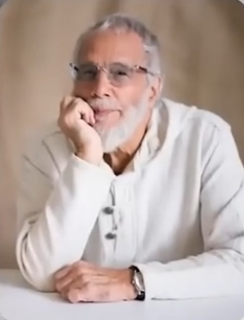

# ادعا

<video src="./claim.mp4" controls>

# جواب

#### ایا واقعا همینطوره ؟

**پروفسور کیت** ال مور دانشمند برجسته جنین شناسی بعد از مطالعه قرآن مسلمان میشه

    

**محمد علی کلی** بوکسور معروف آمریکایی که بعنوان یکی از بزرگترین ورزشکاران تاریخ شناخته میشه بعد از مطالعه قرآن مسلمان میشه

    
    

**آرنود فان دورن** عضو گروه ضد اسلامی در هلند که فیلم علیه پیامبر اسلام میسازه بعد از آشنایی و مطالعه دقیق قرآن مسلمان میشه

    

**موریس بوکای** پزشک فرانسوی بعد از مطالعه قرآن به دین اسلام مشرف شد 

    

**شکیل اونیل** یکی از بزرگترین و موثر ترین بازیکنان تاریخ بسکتبال بعد از مطالعه قرآن مسلمان میشه

    

**کیت استیونز** خواننده معروف بریتانیایی بعد از مطالعه قرآن مسلمان میشه و اسمشو به یوسف اسلام  تغییر میده

    

#### حالا به نظر شما کسی وجود داره که قرآن را دقیق مطالعه کنه و مسلمان نشه