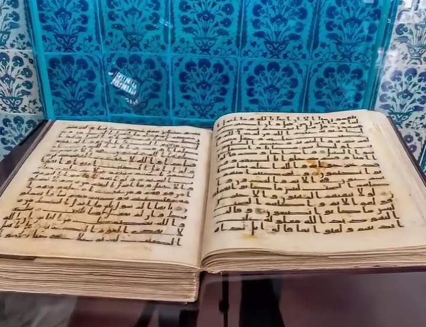
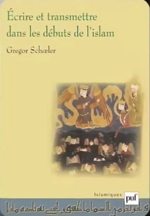
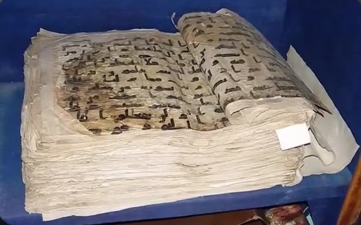
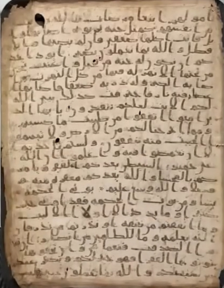
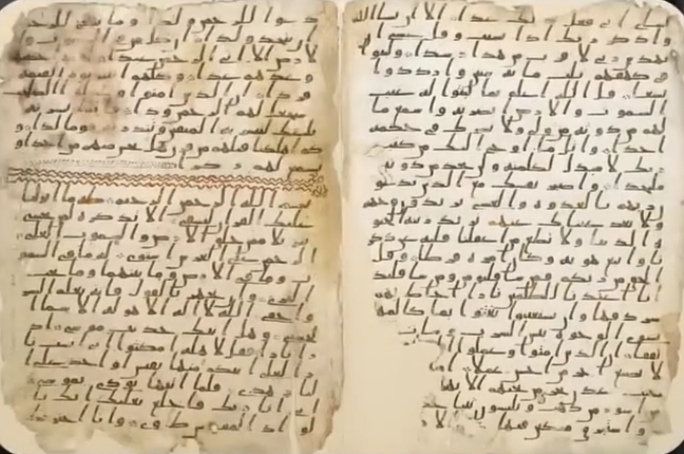
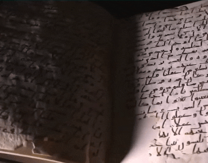
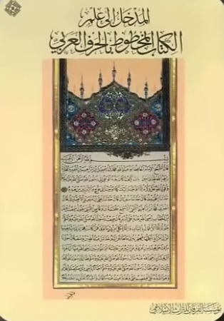
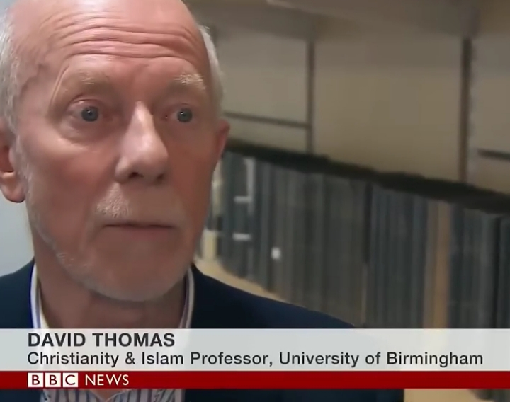

# ادعا

<video src="./claim.mp4" controls>

<!-- 
این کامنت رو در فایل اچ تی ام ال نزار
خلاصه محتوای ویدیو : هیچ قران کامل با 114 سوره از قرن اول اسلام وجود نداره و یا حتی میشه گفت در 200 سال اول اسلام یک نسخه از قرآن وجود نداره
 -->

# جواب 

قرآن توپ قاپی نسخه مکتوب از قرن یکم هجری زمان خلافت عثمان بن عفان که در موزه توپ قابی ترکیه نگهداری میشه حاوی 114 سوره است و با قرآن امروزی کلمه به کلمه یکسانه
نه کلمه ای کم داره و نه کلمه ای اضافه داره فقط چندتا از صفحاتش به خاطر گذر زمان آسیب دیدن 

پروفسور گرگور شولر شرق شناس و پژوهشگر برجسته سوئیسی در کتاب سنت شفاهی و مکتوب در اسلام میگه

    
    

قرآن توپ قابی نسخه کاملی از قرآن است که در زمان خلافت خلیفه سوم مسلمانان جمع آوری شده و کاملا منطبق با قرآن امروزیه

**قرآن سمرقند :**

**قرآن صنعا :**

**قرآن بیرمنگام :**

همه این نسخه ها دقیقا با قرآنی که امروزه مسلمانان در دست دارند یکیه 
اما در طول زمان دچار آسیب شدند و در بعضی از نسخه ها فقط بخش هایی از اونها باقی موندن 

    

و نسخه هایی که بخضی از اون باقی مونده دلیلی بر ناقض بودن کل قرآن نیست 
و نکته مهم اینه که در در همه این نسخه ها ترتیب سوره ها و آیات دقیقا باهم برابره

اگر قرآن در 200 سال اول کامل نبوده پس اختلاف نسخه ای باید رایج می بود  مثل تورات و انجیل با چندین نسخه و با تفاوت های زیاد
اما قرآن رو در هر کجای دنیا بازکنی آیه اول سوره بقره میگه : **الم** و آیه اخر سوره ناس میگه : **من الجنت والناس**
و هیچ نسخه ای از قرآن کشف نشده که محتوای متفاوتی داشته باشه
آیا منطقیه که متنی با 200 سال نبودنش امروزه کلمه به کلمه در سراسر دنیا یکی باشه ؟

فرانسوا دروش در کتاب تحلیل نسخه های قرآنی میگه :

    
    

#### متن قرآن از قرن اول هجری ثبت شده و نسخه های اولیه با متن امروزی تفاوتی ندارند

دیوید توماس استاد بازنشسته دانشگاه بیرمنگام در کتاب خودش به نام کتاب مقدس با قرآن میگه :

    

شواهد تاریخی و نسخه های  کهن نشون میده که قرآنی که امروزه مسلمانان در دست دارند همون قرآنیه که از قرون اولیه توسط پیامبر اسلام ارائه شده

پس وقتی یک نسخه قرآن از 1400 سال پیش با قرآن امروز دقیقا یکیه دیگه ادعای نبودن قرآن کامل یه بازی تبلیغاتیه