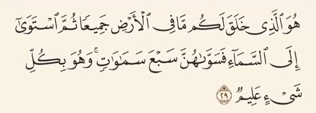
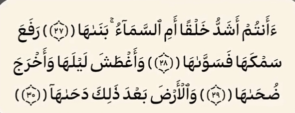

# ادعا

<video src="./claim.mp4" controls>

# جواب

خدا در آیه 29 سوره بقره نمیگه بعد از خلق زمین آسمان را خلق کردیم میگه :
### خلق لکم ما فی الارض
اینجا حتی صحبت از آفرینش زمین هم نیست میگه :

    

### هر آنچه درزمین است برای شما خلق کردیم 
و بعد میگه :
### ثم استوی الی السماء
یعنی :
### بر آسمان مستقر شد
آسمانی که از قبل خدا اون رو خلق کرده بود و بعد از آن به هفت آسمان تقسیم میکنه
خب کجای این آیه حرف از آفرینش آسمان زده میشه ؟

و در سوره نازعات هم نمیگه خدا زمین را بعد از آسمان خلق کرد میگه :

    

### بعد از برافراشتن آسمان و نظم دادن آن زمین را بگسترانید و تغییراتی در اون شکل داد
اینجا هم حرف از آفرینش زمین نمیزنه

خدا در هیچ جای قرآن نمیگه که اول آسمان را خلق کردیم یا زمین رو 

استیون هاوکینگ فیزیکدان معروف بریتانیایی در کتاب خودش به نام تاریخچه مختصر زمان میگه
جهان از یک حالت بسیار فشرده و داغ بر اثر یک انفجار بزرگ از هم جدا شدند که این نظریه علمی به نام بیگ بنگ شناخته میشه

    

و خداوند در سوره انبیاء آیه 30 چه زیبا میفرماید
### آیا کافران ندیدند که آسمانها و زمین به هم پیوسته بودند ، پس آن دو را از هم جدا ساختیم
این آیه به وضوح به یکی بودن آسمانها و زمین و سپس بازشدن و گسترش اونها اشاره میکنه که دقیقا مطابق نظریه علمی بیگ بنگه

و در سال 1921 ادوین هابل ستاره شناس معروف آمریکایی

    

قانون انبساط رو کشف کرد  
این قانون بیان میکنه که 
#### کهکشان ها در حال دور شدن از یکدیگر هستند و جهان درحال گسترش است 
و خداوند در آیه 47 سوره ذاریات میفرماید :
### آسمان را با قدرت خود برافراشتیم و پیوسته آن را گسترش می دهیم
اگر این نظریه علمی نیست پس جیه ؟
قضاوت با شما آیا قرآن کلا یک بشر میتونه باشه ؟!