# ادعا 

<video src="./claim.mp4" controls>

# جواب 

نوح 950 سال عمر کرد منبع : آیه 14 سوره عنکبوت
رستم 700 سال عمر کرد منبع : فقط توی شاهنامه فردوسی اومده که رستم عمر زیادی کرد و هیچ ذکری از طول عمرش نشده

    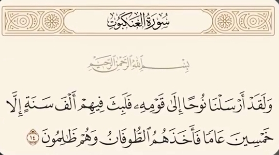
    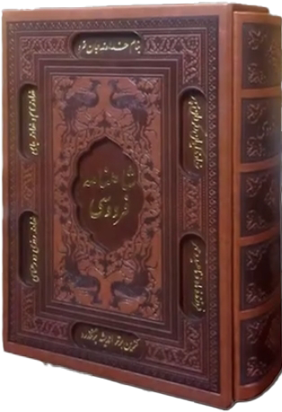
    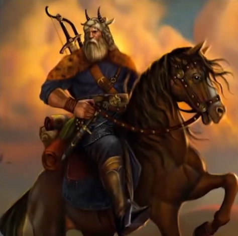

ضحاک پادشاهی ستمگری بود که شیطان او را فریب میده و دو مار از روی شونه هاش ظاهر میشه  منبع : شاهنامه فردوسی ، بدون سند تاریخی 
زمانی که موسی به فرمان خدا نزد فرعون میره خدا به موسی دستور میده عصا شو بندازه ، عصا به فرمان خدا تبدیل به یک مار بزرگ میشه تا قدرت خدا را به فرعون و جادوگران فرعون نشون بده منبع : سوره طه آیه 20 و تورات فصل 4 آیه 3

    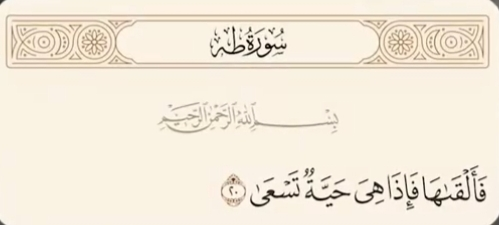
    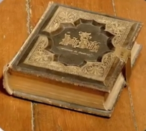
    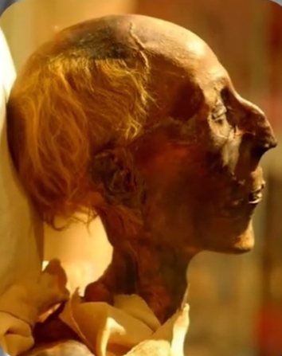
    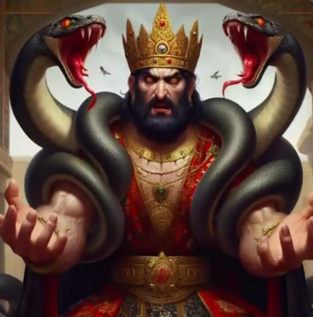

کیکاووس با عقاب ها به آسمون پرواز میکنه اما در این پرواز سقوط میکنه و میمیره منبع : شاهنامه فردوسی و هیچ سند تاریخی نداره 
داستان پرواز سلیمان با قالیچه موضوع قالیچه یه افسانه است منبع : داستان های افسانه ای بدون ذکر سند تاریخی 

    
    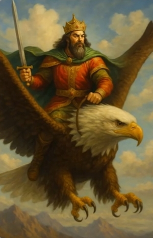

بیژن به فرمان کیخسرو میره توران و توسط افراسیاب پادشاه توران دستگیر میشه و توی یک چاه زندانی میشه اما بعد از مدتی از زندان فرار میکنه منبع : شاهنامه فردوسی بدون ذکر سند و منبع تاریخی
برادران یوسف او را به چاه انداختن سپس یک کاروان یوسف رو از چاه بیرون آورد و به مصر برد منبع : آیات 10 تا 20 سوره یوسف و تورات کتاب پیدایش فصل 37

    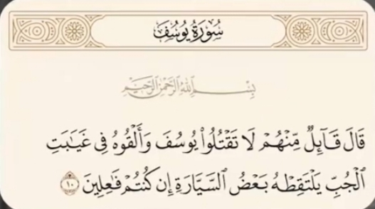
    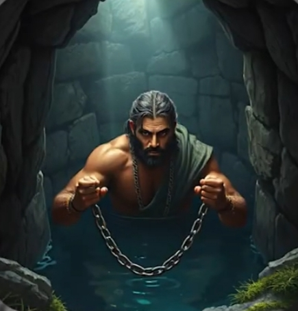
    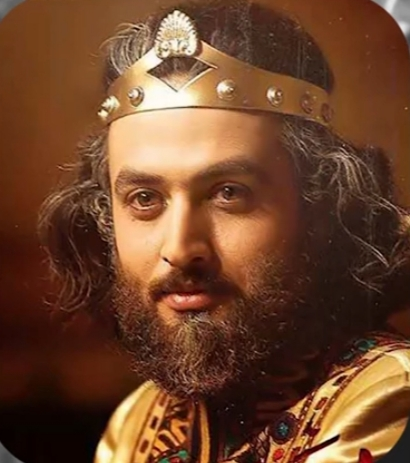

زال چون موهای سفیدی داشت پدرش اونو ترک کرد بعد از سیمرغ که پرنده ای بزرگ و حکیم بود پیداش میکنه و تو کوه ها اونو بزرگ میکنه منبع : شاهنامه فردوسی بدون ذکر سند 
زمانی که یونس از پیش قومش فرار میکنه توی دریا گرفتار میشه و بعد تو شکم ماهی بزرگی میوفته بعد از دعا و استغفار نجات پیدا میکنه منبع : سوره انبیاء ایه 87

    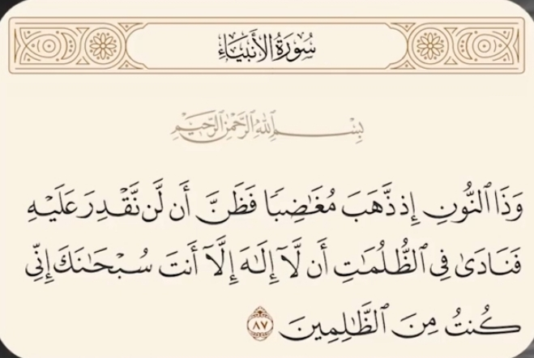
    
    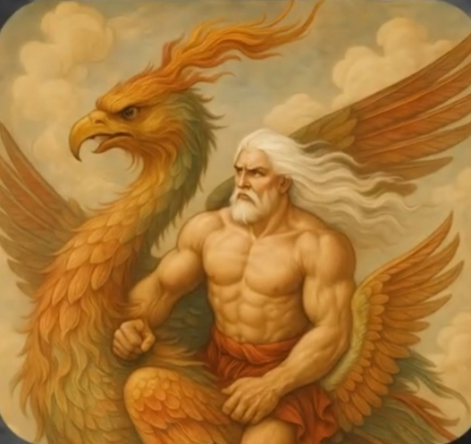

دکتر جلال خالقی مطلق یکی از بزرگترین شاهنامه پژوهان و محققان ادبیات کلاسیک ایران میگه :

    

#### شخصیت هایی چون رستم ، زال ، سیمرغ ، کاوه و ضحاک نه اشخاص تاریخی بلکه چهره های اسطوره  هایی اند که با گذر زمان لباس حماسه به تن کردند

ژاله آموزگار و مهرداد بهار فرزند ملک الشعرای بهار از نویسندگان و پژوهشگران ایرانی معتقدند :

    
    

#### شخصیت های شاهنامه همگی شخصیت های افسانه ای هستند که در کتاب ارزشمند شاهنامه فردوسی از اونها یاد شده

