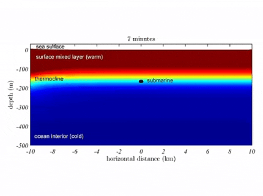

# ادعا 1

<video src="./claim-part1.mp4">

# جواب 1

در سال 1868 میلادی دکتر **جان هارلو** پزشکی آمریکایی پس از سال ها مطالعه کشف میکنه که بخش جلوی مغز که پشت پیشانی قرار داره مسئول تصمیم گیری برای انتخاب کار درست یا نادرسته 

    
    

و همچنین **آنتونیو داماسیو** عصب شناس معروف پرتغالی در سال 1994 در کتاب خود بنام **خطای دکرات** میگه :

     
     
     

جلوی مغز که پشت پیشانی قرار داره نقش بسیار مهمی در دروغگویی داره

اما قرآن 1400 سال قبل در آیات 15 و 16 سوره علق درباره فرد خطا کار میگه :

    

### اگر از خطایش دست نکشد پیشانی اش را می گیریم و بسوی عذاب می کشانیم همان پیشانی دروغگو و خطاکار
این توصیف قرآنی با یافته های علمی مدرن کاملا همخوانی داره
 اون هم در عصری که ابزار های پیشرفته پزشکی مثل ام آر آی ، سی تی اسکن یا نوار مغز وجود نداشت این دقت در توصیف چگونه ممکنه؟
 اگر قرآن نوشته دست پیامبره ، پیامبر از کجا به این اطلاعات دقیق علمی رسیده بود؟

 # ادعا 2

<video src="./claim-part2.mp4">

# جواب 2

در سال 1930 ویلیام بیب اقیانوس شناس آمریکایی با زیردریایی به عمق بیش از 900 متری اقیانوس اطلس رفت و دید که در اون عمق تاریکی مطلق حاکمه 

    
    
    

و در سال 1970 **هنری استایمر** اقیانوس شناس معروف کشف میکنه که در اقیانوس ها علاوه بر موج های سطحی موج هایی عظیمی در عمق 300 تا 1000 متری شکل میگرند که به دلیل تفاوت دمایی و شوری آب در لایه های مختلف ایجاد میشن 

    
    

اما قرآن 14 قرن پیش در آیه 40 سوره نور میگه تاریکی های عمیق دریا که موجی روی آن را می پوشاند و بالای آن موج دیگر است این توصیف با یافته های علمی مدرن کاملا مطابقت داره 

    

پرسش اینجاست که پیامبر در عصر بدون فناوری چطور به چنین دانشی دست یافته و اگر پیامبر با مطالعه عمیق کتب یهودیت و مسیحیت به این دانش رسیده چرا خود اونها به این نتیجه نرسیدن ؟

 # ادعا 3

<video src="./claim-part3.mp4">

# جواب 3

اولا چه سودی داشته برای اون آدم ؟ نه پول ، نه آسایش دنیایی بهش رسید بلکه جز سختی دشمنی ، جنگ و رنج چیزی نصیبش نشده پس منطقی نیست که بگیم این کار برای منفعت شخصی بوده
دوما اگر پیامبر اسلام سواد خوندن و نوشتن داشت و اون رو از دیگران پنهان میکرد بی تردید نخستین کسانی که این موضوع رو برملا میکردند مخالفان سرسخت او بودند همون هایی که به دنبال کوچکترین بهانه ای برای مخالفت با پیامبر بودند 
اونها اعتراض نکردند که پرا در قرآن آیاتی اومده که که تو رو امی و بیسواد معرفی میکنه
گذشته از این اگر فرض کنیم پیامبر با سوادترین فرد اون زمان بوده این سوال پیش میاد که او با چه دانشی به حقایق و علومی دست یافته که بشر بعد از 1400 سال با استفاده از پیشرفته ترین فناوری ها فقط تونسته بخشی از اونها رو کشف بکنه